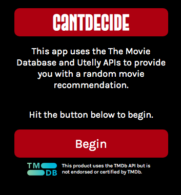
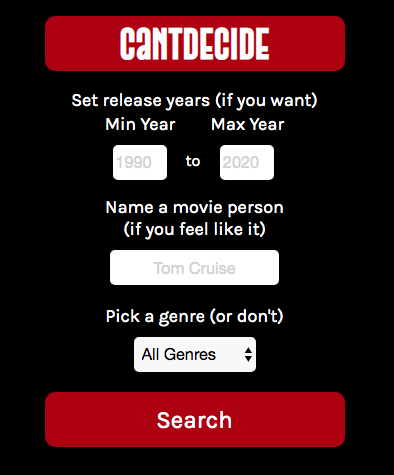
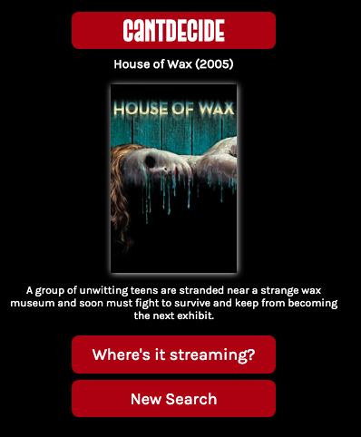
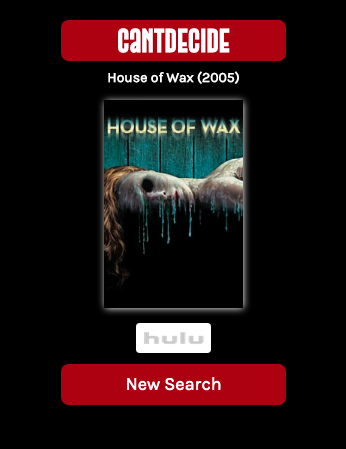

# [CantDecide](https://jordanhenn.github.io/cantdecide/) #
The ultimate movie recommendation app. Made using the TMDb and Utelly APIs. 

## Screenshots and Summary ##
  

Home page of the site.

  

The search form where the user determines their search criteria for a movie recommendation. All inputs are optional. The user could immediately hit the search button without filling anything out and would still receive a recommendaiton.

  

The initial movie recommendation returned from the tmdb API after hitting the search button. Includes title, year, and overview.

  

Once the user hits the "Where's it streaming?" button on the previous page, the movie's tmdb ID is sent through the Utelly API to retrieve its current streaming locations. 

### Tech used ###
HTML/CSS/JavaScript/jQuery

